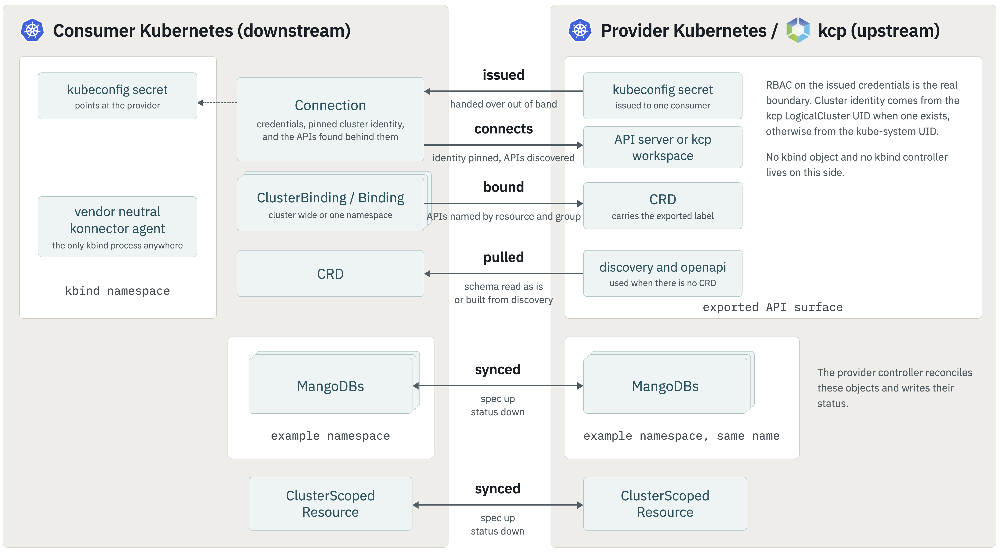

</img>

[](https://github.com/kbind-dev/kbind/blob/main/LICENSE)
[](https://github.com/kbind-dev/kbind/releases/latest)

# kbind

You are invited to [contribute](#contributing)!

## What is it?

kbind (formerly known as kube-bind) provides better support for service providers and consumers that reside in distinct Kubernetes clusters.

- A service provider defines its API in terms of CRDs, exports it for use from other clusters, and controls access through Kubernetes RBAC.
- Service consumers identify the services they want to consume.
- The service CRDs get installed in the service consumer clusters, with objects of the defined kinds written and read by the service consumers.
- The service provider indirectly reads and writes those objects as the interface to the service that it provides.
- The service provider does not inject controllers/operators into the service consumer's cluster.
- A single vendor-neutral, OpenSource agent per consumer cluster, the **konnector**, connects it with the requested services.

## Try it out

Follow the [Quickstart](docs/content/setup/quickstart.md) to try v2 with two local Kubernetes clusters. It runs from source without depending on a published v2 release.

With the [CLI installed](docs/content/setup/kubectl-plugin.md), a [provider offering a `widgets` API](docs/content/developers/backend/index.md), and the [v2 konnector installed](docs/content/setup/helm.md) in your consumer cluster:

```shell
kubectl bind login https://bind.example.com
kubectl bind export widgets --kubeconfig=./consumer.kubeconfig --install-konnector=false
```

Replace the provider URL and consumer kubeconfig with your own. The konnector makes the Widget API available in the consumer cluster, without a Widget-specific controller running there. See the [CLI guide](docs/content/setup/kubectl-plugin.md) for details.

## For more information

For more information go to https://kbind.dev or watch the [ContainerDays talk](https://www.youtube.com/watch?v=dg0g15Qv5Fo&t=1s) or the [KubeCon talk](https://www.youtube.com/watch?v=Uv0ivz5xej4).

kbind is following this manifesto from the linked talk:

Let's design a post-operator / post-cluster technology, that allows a service provider persona as a first-class citizen and can securely provide centrally operated kube-native services.

## Contributing

We ❤️ our contributors! If you're interested in helping us out, please check out
[Contributing to kbind](docs/content/contributing/index.md) and [kbind Project Governance](https://github.com/kbind-dev/kbind/blob/main/GOVERNANCE.md).

The [developer guide](docs/content/developers/index.md) covers the architecture, development environments, builds, tests, and code generation.

## Getting in touch

There are several ways to communicate with us:

- The [`#kbind-dev` channel](https://kubernetes.slack.com/archives/C046PRXNJ4W) in the [Kubernetes Slack workspace](https://slack.k8s.io).
- Our mailing list [kube-bind-dev](https://groups.google.com/g/kube-bind-dev) for development discussions.
- Our bi-weekly community meetings, every second Thursday at 11am EST (5pm CET).
  Join the mailing list for an invite and see our [community meeting notes](https://docs.google.com/document/d/1qztpKOmdZu5iWq_4N9n3AZpcAPuPhBiGNbje5GPg0iM) for upcoming and past agendas.

See the [community page](docs/content/community/index.md) for more details.

## Technical Overview



The konnector connects directly to the provider's Kubernetes API. The backend
adds a catalog, authentication, and credential issuance, but is not required for
synchronization. See the [architecture guide](docs/content/developers/architecture.md) for the implementation details.

## Usage

To get familiar with setting up the environment, please check out the
[setup guide](docs/content/setup/index.md) and [usage guide](docs/content/usage/index.md). For an existing installation, start with [Moving from 0.x](docs/content/usage/migration.md).

### Limitations

Resource scope, namespace, and name are preserved between
clusters. Namespace isolation must be arranged by the deployment.
See [API concepts](docs/content/usage/api-concepts.md) for schema limitations and [Resource Synchronization](docs/content/usage/synchronization.md) for isolation and cleanup behavior.
