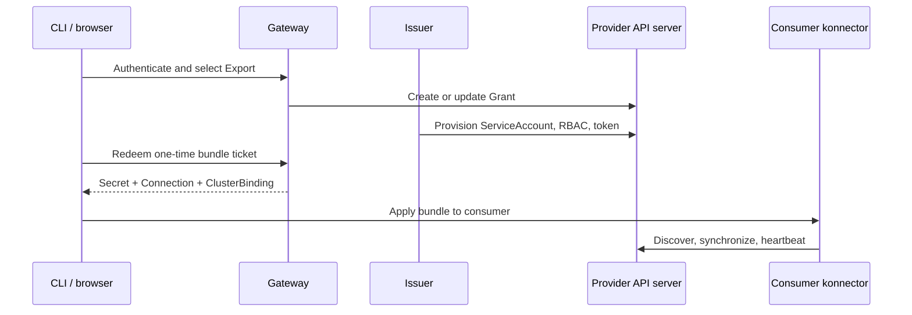

# Architecture Overview

This is development-focused documentation intended to explain resource synchronization between consumer and provider clusters. For user-facing behavior, see the [Synchronization User Guide](../usage/synchronization.md).

v2 separates synchronization from service discovery, authentication, and credential issuance. A core-only deployment runs one consumer-side konnector and no kbind-specific provider controller.

## Core control loop

| Package | Responsibility |
| --- | --- |
| `cmd/konnector` | Wire the consumer manager, multicluster manager, provider, and reconcilers |
| `engine/connection` | Resolve credential Secrets, pin cluster identity, discover APIs, handle schema policies and heartbeat Leases |
| `engine/provider` | Engage Ready Connections as multicluster-runtime provider clusters, disengage unavailable ones |
| `engine/binding` | Reconcile ClusterBinding/Binding readiness, selected APIs, related resources, and cleanup |
| `engine/crdpull` | Install and update consumer CRDs from provider CRDs |
| `engine/openapi` | Synthesize consumer CRDs from provider discovery and OpenAPI v3 |
| `engine/sync` | Start per-binding/GVR syncers, reconcile spec/status and ownership, and stop obsolete syncers |
| `engine/remote` | Read kubeconfigs and determine provider identity |
| `engine/mapper` | Compile-time object-key mapping interface |

The consumer manager watches core resources. A Ready Connection supplies the credentials for an engaged provider cluster. Syncers use that cluster's client for writes, API reader for fresh reads, and cache watches for provider changes. A periodic resync is a backstop, not the primary status transport.

When a Connection loses readiness, the provider disengages and its syncers stop. Recovery creates a fresh engaged cluster and rebuilds syncers, rather than retaining clients and caches tied to a dead connection. Leader election gates the consumer controllers and provider engagement together.

For Kubernetes, cluster identity uses the `kube-system` namespace UID, on kcp-like providers it uses the `LogicalCluster` UID when available. This is identity pinning, not a replacement for TLS verification or RBAC.

## Service layer

`cmd/backend` wires independently enabled gateway, issuer, and reaper modules. The gateway embeds the static UI from `web/`. The CLI in `cli/` is an HTTP client for that gateway.

Once credentials and the bundle exist, the core does not require the gateway to remain online. Grant revocation still requires the issuer to remove provisioned credentials. The optional reaper observes provider-side heartbeat Leases and removes stale Grants under its configured policy.

## Extension points and boundaries

`backend/auth.Authenticator` provides a gateway identity and optional login routes. `backend/issuer.Issuer` provisions and revokes credentials. The in-tree issuer is Kubernetes-specific, kcp workspace issuance requires a separate implementation.

`engine/mapper.Mapper` translates namespace/name keys for synced API instances. Its two methods must round-trip. Install a custom implementation through `sync.WithMapper(...)` in an out-of-tree build, there is no `mapper` CRD field or flag. The shipped mapper is `Identity`. Mapping does not change resource scope, and related-resource synchronization does not yet use this interface.

The provider's RBAC is the authorization boundary. Conflict markers protect against accidental ownership collisions, they do not prevent a holder of overprivileged credentials from bypassing the konnector.

The historical [slim-core proposal](https://github.com/kbind-dev/kbind/blob/v2-next/docs/proposals/v2-slim-core.md) and [extended-layer proposal](https://github.com/kbind-dev/kbind/blob/v2-next/docs/proposals/v2-extended.md) explain design decisions. They include earlier names and planned behavior, the [user guides](../usage/api-concepts.md) and implementation describe the current contract.
