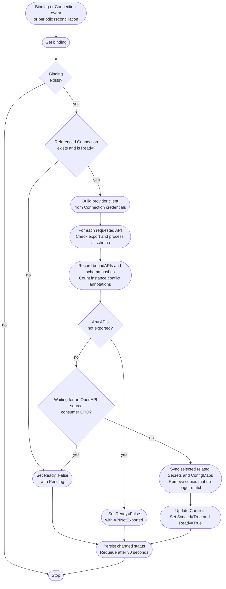
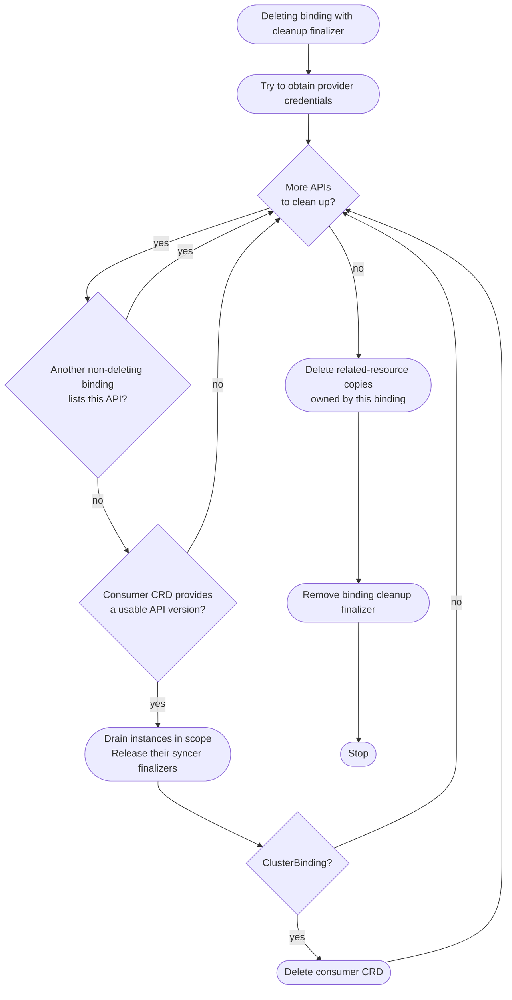

# Binding Controllers

The ClusterBinding and Binding controllers watch their respective binding objects and referenced `Connections` in the **consumer cluster**. Both use the reconciliation logic in `engine/binding`.

They are responsible for:

* Resolving a Ready Connection and validating the requested exported APIs.
* Installing or reading consumer schemas according to the Connection's policies.
* Synchronizing selected related Secrets and ConfigMaps.
* Reporting bound APIs, schema hashes, conflict counts, and readiness.
* Cleaning up instances and related-resource copies when a binding is deleted.

A ClusterBinding operates cluster-wide. A Binding limits instance selection and related-resource processing to its namespace, but does not change CRD scope or make the dynamic instance informers namespace-scoped.

## Overview

The chart shows normal reconciliation after the cleanup finalizer has been added. Binding and Connection events trigger reconciliation, with a 30-second periodic refresh for related resources and conflict counts.

For `CRD`, reconciliation pulls each exported provider schema with creation and updates controlled by `pullPolicy` and `updatePolicy`. For `OpenAPI`, it synthesizes a missing consumer CRD unless `pullPolicy: None`. An existing OpenAPI-source CRD is read, not refreshed by this controller.

A forbidden CRD pull sets `PermissionDenied=True` and `Ready=False`. Other API errors are returned for retry. Conflicts can coexist with `Ready=True`, and `Synced=True` describes setup, not proof that every instance has reached the provider. Instance synchronization runs separately.

## Deletion

Draining requests deletion only for owned provider copies, unless an instance uses `deletion-policy: Orphan`. Provider-client and provider-read failures can leave copies behind, but actual provider-delete errors can block cleanup. Binding cleanup does not wait for provider finalizers as normal instance deletion does.

The overlap check is API-wide, not a comparison of namespaces or Connections. A last ClusterBinding can delete the consumer CRD even when it was externally installed. A namespaced Binding keeps the shared CRD. Read the [cleanup limits](../../../usage/synchronization.md#delete-a-binding) before changing overlapping bindings or relying on automatic pruning.

Implementation: [binding reconcilers](https://github.com/kbind-dev/kbind/blob/v2-next/engine/binding/reconciler.go), [related resources](https://github.com/kbind-dev/kbind/blob/v2-next/engine/binding/related.go), and [cleanup](https://github.com/kbind-dev/kbind/blob/v2-next/engine/binding/cleanup.go).
