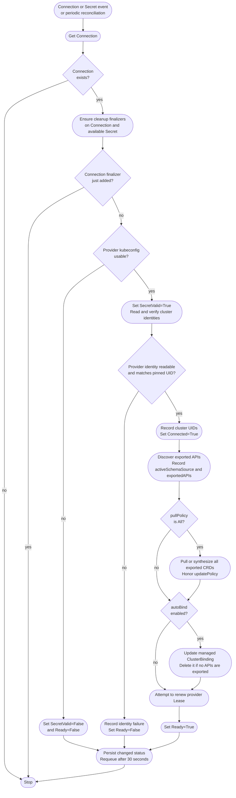
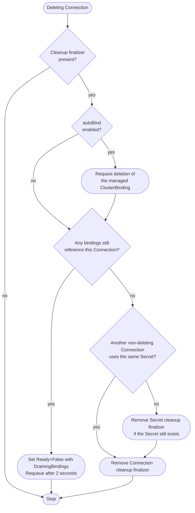

# Connection Controller

The Connection controller watches `Connections` and their referenced `Secrets` in the **consumer cluster**. It is implemented in `engine/connection`.

It is responsible for:

* Validating the provider kubeconfig and pinning provider/consumer identities.
* Discovering exported APIs and recording the active schema source.
* Installing schemas eagerly when `pullPolicy: All`.
* Maintaining an automatic ClusterBinding when `autoBind` is enabled.
* Renewing the provider heartbeat Lease and protecting credentials during cleanup.

## Overview

The chart below shows a non-deleting Connection. Successful reconciliation requeues after 30 seconds by default, so newly exported APIs are discovered without requiring a Secret or Connection edit.

Provider identity/discovery RBAC denials set `PermissionDenied=True` and `Ready=False`. Other API errors are returned for retry rather than continuing through the success path. Heartbeat errors are logged but do not prevent Ready.

`CRD` discovery uses the export label. `OpenAPI` uses discovery and OpenAPI v3. `Auto` tries CRDs first and switches to OpenAPI only after a successful list with no exports, not after a list error. `Bound` defers installation to binding reconciliation, and `None` leaves creation to an external manager.

## Deletion

Explicit bindings are not deleted by this controller. They must be removed separately while credentials and the konnector are still available. Releasing the Secret finalizer does not itself delete the Secret.

See [API concepts](../../../usage/api-concepts.md) for schema policies and credential-rotation limits, and [lifecycle](../../../usage/synchronization.md) for heartbeat and deletion behavior.

Implementation: [Connection reconciler](https://github.com/kbind-dev/kbind/blob/v2-next/engine/connection/reconciler.go).
