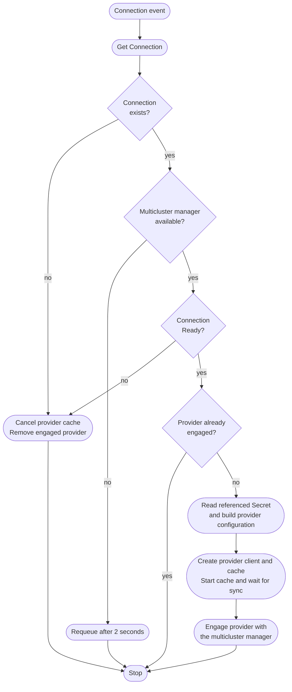

# Konnector

The konnector coordinates the consumer controllers and a provider-cluster connection for each Ready `Connection`. The `connection-provider` controller in `engine/provider` watches `Connections` in the **consumer cluster**.

It is responsible for:

* Starting a provider client and cache when a Connection becomes Ready.
* Making that provider available to the multicluster manager.
* Stopping the provider cache when its Connection disappears or loses readiness.

The [Connection controller](connection.md) validates credentials and discovers APIs. The [Binding controllers](binding.md) prepare consumer schemas, and the [Synchronization controllers](synchronization.md) start or stop instance syncers. These replace the old `APIServiceBinding` and per-provider controller arrangement.

## Overview



Configuration, cache-start, and engagement errors are returned for retry. A failed engagement cancels the new cache and removes its entry. Connection events also enqueue the managed-CRD controller, which stops instance syncers when readiness is lost. Recovery creates a fresh provider client/cache, and syncers are rebuilt against that new provider.

An already-engaged Ready Connection is left unchanged. Updating a valid credential Secret alone does not rebuild its client, see [credential rotation](../../../usage/api-concepts.md#credentials-and-cluster-identity).

## Runtime options

The konnector runs against the **consumer** kubeconfig, or uses its in-cluster ServiceAccount. Provider credentials come from each Connection's referenced Secret, not from the konnector's own Kubernetes identity.

```bash
go run ./cmd/konnector --help
```

| Flag | Default | Purpose |
| --- | --- | --- |
| `--metrics-bind-address` | `:8085` | Metrics listener, `0` disables it |
| `--health-probe-bind-address` | `:8081` | `/healthz` and `/readyz` listener |
| `--leader-elect` | `false` | Run only the elected replica's consumer controllers and provider engagement |
| `--leader-election-id` | `konnector.kbind.io` | Leader-election Lease name |

The binary also exposes controller-runtime's kubeconfig and Zap logging flags, use its `--help` output for those options. There are no flags for legacy isolation modes, namespace remapping, schema selection, or per-provider credentials: schema and credential configuration belongs in the [core API](../../../reference/crd/index.md#corekbindiov1alpha1).

The chart forces leader election when `replicaCount > 1`. Outside the chart, enable it explicitly for multiple replicas. Probe success indicates the process is serving, not that every Connection or binding is Ready. Inspect those objects' conditions to assess synchronization health.

See [Konnector configuration](../index.md) for chart values and consumer RBAC, and [troubleshooting](../../../usage/troubleshooting.md) for runtime status.

Implementation: [process setup](https://github.com/kbind-dev/kbind/blob/v2-next/cmd/konnector/main.go) and [Connection provider](https://github.com/kbind-dev/kbind/blob/v2-next/engine/provider/connection_provider.go).
