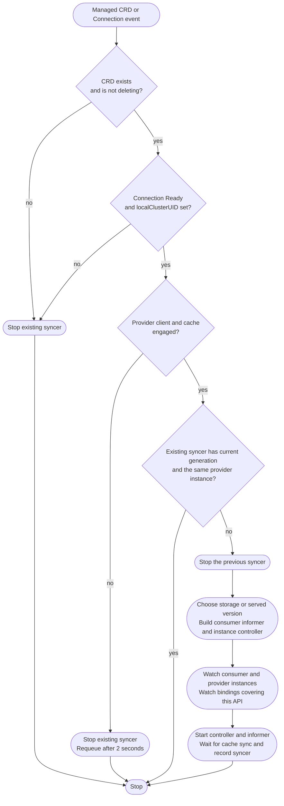
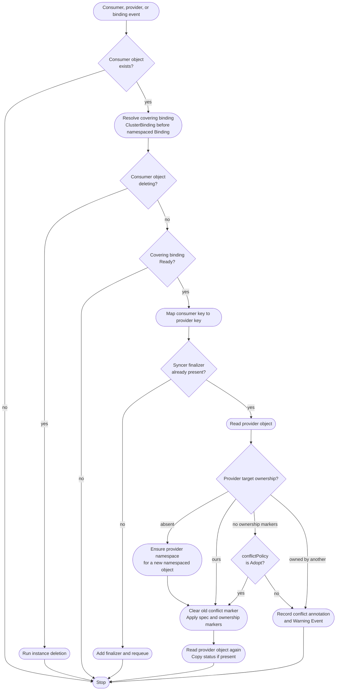
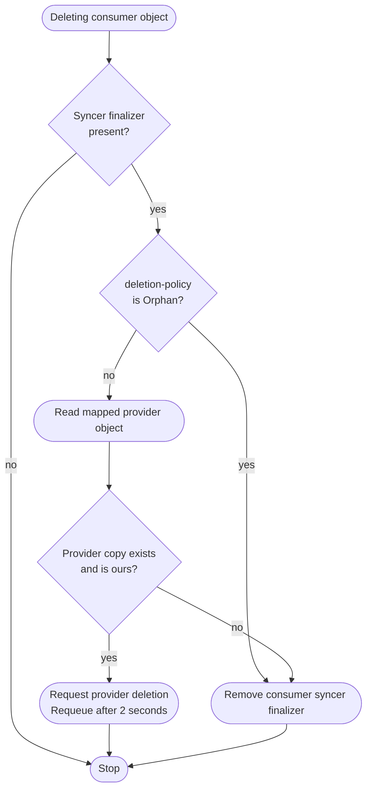

# Synchronization Controllers

The managed-CRD controller watches kbind-managed `CustomResourceDefinitions` and their `Connections` in the **consumer cluster**. It starts a dynamic instance syncer for each selected group/version/resource, or GVR. Both are implemented in `engine/sync`.

They are responsible for:

* Starting, stopping, and rebuilding syncers as CRDs and provider connections change.
* Selecting instances covered by a Ready ClusterBinding or namespaced Binding.
* Applying consumer spec to owned provider objects and copying provider status back.
* Reporting ownership conflicts without overwriting foreign objects.
* Deleting owned provider copies before releasing consumer instance finalizers.

## Overview

The managed-CRD controller resolves the provider from the CRD's `core.kbind.io/connection` annotation. A missing annotation or an API error is returned for retry.

The generation check detects schema changes. Comparing the provider instance also detects re-engagement after an outage, so a syncer cannot keep the old client/cache simply because the CRD generation is unchanged.

## Instance reconciliation

Consumer events, binding events, and provider cache events enqueue instances. Provider events are filtered by consumer-cluster UID and mapped back to the consumer object key. Reads of provider objects use the engaged cluster's API reader, while writes use its client.

Ownership requires both the consumer-cluster UID and consumer-object UID. `Adopt` accepts only markerless objects, never objects owned by another consumer/object. Spec apply uses server-side apply with forced field ownership. An absent provider status does not clear an existing consumer status.

Forbidden namespace creation or spec apply emits a Warning Event and retries after 30 seconds. Other API errors are returned for retry. Successful instance reconciliation schedules a ten-minute backstop, with watches and the consumer informer's resync providing additional triggers.

## Instance deletion

This path runs even if the binding is no longer Ready. An owned provider object must disappear before its consumer finalizer is released. Provider read/delete errors are retried, not treated as absence. Foreign objects are left untouched.

The stock `Mapper` preserves scope, namespace, and name. It is a compile-time extension point for instance keys, not a CRD isolation flag. Related-resource sync remains in binding reconciliation and does not use that mapper.

See [Resource Synchronization](../../../usage/synchronization.md) for conflict policy, finalizers, related-resource selection, and supported behavior.

Implementation: [managed-CRD controller](https://github.com/kbind-dev/kbind/blob/v2-next/engine/sync/crd_controller.go), [binding resolution](https://github.com/kbind-dev/kbind/blob/v2-next/engine/sync/resolve.go), and [instance syncer](https://github.com/kbind-dev/kbind/blob/v2-next/engine/sync/syncer.go).
