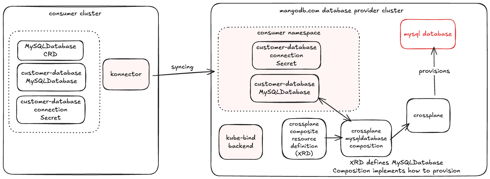

# Crossplane Integration

This document provides an example deployment walkthrough showing how to integrate kube-bind with Crossplane and how to deploy a sample managed MySQL resource using two kind clusters: a provider cluster (where Crossplane runs and kube-bind backend to export APIs) and a consumer cluster (which allows to bind those APIs using kube-bind konnector).

!!! note
    This walkthrough uses namespaced Crossplane resources so the example stays in the same `default` namespace on both clusters.



## Setup

The following sections will guide you through the one-time setup that is required for providing MySQL databases using Crossplane and kube-bind.

Follow the [prerequisites](index.md#prerequisites), then select the provider:

```bash
kubectl config use-context provider
```

### Install Crossplane

Install Crossplace in your Kubernetes cluster where the kube-bind backend will run. You can follow the [official installation guide](https://docs.crossplane.io/v2.1/get-started/install) from the Crossplane documentation.

```bash
helm repo add crossplane-stable https://charts.crossplane.io/stable
helm repo update

helm install crossplane crossplane-stable/crossplane \
  --namespace crossplane-system \
  --create-namespace
```

### Install Crossplane provider-sql

In this example, we will set up MySQL database:

```bash
kubectl apply -f - <<EOF
apiVersion: pkg.crossplane.io/v1
kind: Provider
metadata:
    name: provider-sql
spec:
    package: xpkg.upbound.io/crossplane-contrib/provider-sql:v0.13.0
EOF
```

Deploy also Crossplane function for Go templating:

```bash
kubectl apply -f - <<EOF
apiVersion: pkg.crossplane.io/v1
kind: Function
metadata:
  name: function-go-templating
spec:
  package: xpkg.crossplane.io/crossplane-contrib/function-go-templating:v0.9.2
EOF
```

### Setup the MySQL Deployment

Create and set up `Deployment`, `PersistentVolume`, `PersistentVolumeClaim` and `Service` for the MySQL instance.

```bash
kubectl apply -f - <<EOF
apiVersion: apps/v1
kind: Deployment
metadata:
  name: mysql
spec:
  selector:
    matchLabels:
      app: mysql
  strategy:
    type: Recreate
  template:
    metadata:
      labels:
        app: mysql
    spec:
      containers:
      - image: mysql:9
        name: mysql
        env:
          # Use secret in real usage
        - name: MYSQL_ROOT_PASSWORD
          value: password
        ports:
        - containerPort: 3306
          name: mysql
        volumeMounts:
        - name: mysql-persistent-storage
          mountPath: /var/lib/mysql
      volumes:
      - name: mysql-persistent-storage
        persistentVolumeClaim:
          claimName: mysql-pv-claim
---
apiVersion: v1
kind: PersistentVolume
metadata:
  name: mysql-pv-volume
  labels:
    type: local
spec:
  storageClassName: manual
  capacity:
    storage: 1Gi
  accessModes:
    - ReadWriteOnce
  hostPath:
    path: "/mnt/data"
---
apiVersion: v1
kind: PersistentVolumeClaim
metadata:
  name: mysql-pv-claim
spec:
  storageClassName: manual
  accessModes:
    - ReadWriteOnce
  resources:
    requests:
      storage: 1Gi
---
apiVersion: v1
kind: Service
metadata:
  name: mysql
spec:
  ports:
  - port: 3306
  selector:
    app: mysql
  clusterIP: None
EOF
```

### Configure Crossplane

Time to create a Crossplane XRD and Composition for a managed MySQL database. Apply both manifests:

```bash
kubectl apply -f - <<EOF
apiVersion: apiextensions.crossplane.io/v2
kind: CompositeResourceDefinition
metadata:
  name: mysqldatabases.mangodb.com
spec:
  scope: Namespaced
  group: mangodb.com
  names:
    kind: MySQLDatabase
    plural: mysqldatabases
  versions:
  - name: v1
    served: true
    referenceable: true
    schema:
      openAPIV3Schema:
        type: object
        properties:
          spec:
            type: object
            properties:
              name:
                description: The name of the database to create
                type: string
            required:
            - name
          status:
            type: object
            properties:
              ready:
                description: Whether the database setup is ready
                type: boolean
              connectionSecret:
                description: Name of the connection secret
                type: string
EOF
```


```bash
kubectl apply -f - <<'EOF'
apiVersion: apiextensions.crossplane.io/v1
kind: Composition
metadata:
  name: mysql-database-simple
spec:
  compositeTypeRef:
    apiVersion: mangodb.com/v1
    kind: MySQLDatabase
  mode: Pipeline
  pipeline:
  - functionRef:
      name: function-go-templating
    input:
      apiVersion: gotemplating.fn.crossplane.io/v1beta1
      inline:
        template: |
          {{ $objName := .observed.composite.resource.metadata.name }}
          {{ $dbName := .observed.composite.resource.spec.name }}
          {{ $objNamespace := .observed.composite.resource.metadata.namespace }}
          {{ $userName := printf "%s-user" $dbName }}
          {{ $secretName := printf "%s-secret" $dbName }}
          {{ $credentials := printf "%s-credentials" $objName }}
          ---
          apiVersion: mysql.sql.m.crossplane.io/v1alpha1
          kind: Database
          metadata:
            annotations:
              gotemplating.fn.crossplane.io/composition-resource-name: database
              {{ if eq (.observed.resources.database | getResourceCondition "Synced").Status "True" }}
              gotemplating.fn.crossplane.io/ready: "True"
              {{ end }}
            name: {{ $dbName }}
            namespace: default
          spec:
            forProvider: {}
            providerConfigRef:
              kind: ProviderConfig
              name: mysql-cfg
          ---
          apiVersion: v1
          kind: Secret
          metadata:
            annotations:
              gotemplating.fn.crossplane.io/composition-resource-name: secret-exposed
              gotemplating.fn.crossplane.io/ready: "True"
            labels:
              kube-bind.io/selector: consumer-database
            namespace: default
            name: {{ $credentials }}
          {{ if eq $.observed.resources nil }}
          stringData: {}
          {{ else }}
          stringData:
            username: {{ ( index $.observed.resources "user" ).connectionDetails.username }}
            password: {{ ( index $.observed.resources "user" ).connectionDetails.password }}
            port: {{ ( index $.observed.resources "user" ).connectionDetails.port }}
            endpoint: {{ ( index $.observed.resources "user" ).connectionDetails.endpoint }}
          {{ end }}
          ---
          apiVersion: v1
          kind: Secret
          metadata:
            annotations:
              gotemplating.fn.crossplane.io/composition-resource-name: secret
              gotemplating.fn.crossplane.io/ready: "True"
            namespace: default
            name: {{ $secretName }}
          data:
            password: {{ randAlphaNum 16 | b64enc }}
          ---
          # Hardcoded demo Secret used by ProviderConfig (in default namespace)
          apiVersion: v1
          kind: Secret
          metadata:
            annotations:
              gotemplating.fn.crossplane.io/composition-resource-name: provider-db-conn
              gotemplating.fn.crossplane.io/ready: "True"
            namespace: default
            name: db-conn
          type: Opaque
          stringData:
            endpoint: mysql.default.svc.cluster.local
            port: "3306"
            username: root
            password: password
          ---
          apiVersion: mysql.sql.m.crossplane.io/v1alpha1
          kind: User
          metadata:
            annotations:
              gotemplating.fn.crossplane.io/composition-resource-name: user
              {{ if eq (.observed.resources.user | getResourceCondition "Synced").Status "True" }}
              gotemplating.fn.crossplane.io/ready: "True"
              {{ end }}
            name: {{ $userName }}
            namespace: default
          spec:
            forProvider:
              passwordSecretRef:
                name: {{ $secretName }}
                key: password
            writeConnectionSecretToRef:
              name: {{ printf "%s-connection-secret" $dbName }}
            providerConfigRef:
              kind: ProviderConfig
              name: mysql-cfg
          ---
          apiVersion: mangodb.com/v1
          kind: MySQLDatabase
          metadata:
            name: {{ $objName }}
            namespace: default
          status:
            ready: {{ and (eq (.observed.resources.database | getResourceCondition "Synced").Status "True") (eq (.observed.resources.user | getResourceCondition "Synced").Status "True") }}
            connectionSecret: {{ printf "%s-connection-secret" $dbName }}
          ---
          apiVersion: mysql.sql.m.crossplane.io/v1alpha1
          kind: ProviderConfig
          metadata:
            name: mysql-cfg
            annotations:
              gotemplating.fn.crossplane.io/composition-resource-name: provider-cfg
              gotemplating.fn.crossplane.io/ready: "True"
          spec:
            credentials:
              source: MySQLConnectionSecret
              connectionSecretRef:
                name: db-conn
            tls: preferred
      kind: GoTemplate
      source: Inline
    step: create-mysql-resources
EOF
```


### Export the Database API

Wait for Crossplane to create the CRD and label that CRD, not the XRD:

```bash
kubectl wait --for=create crd/mysqldatabases.mangodb.com --timeout=120s
kubectl wait --for=condition=Established crd/mysqldatabases.mangodb.com --timeout=120s
kubectl label crd mysqldatabases.mangodb.com core.kbind.io/exported=true --overwrite
```

Create a catalog `Export` for the `mysqldatabases.mangodb.com` resource:

```bash
kubectl apply -f - <<EOF
apiVersion: catalog.kbind.io/v1alpha1
kind: Export
metadata:
  name: mysqldatabase
spec:
  title: MySQL Database
  description: Managed MySQL databases provisioned through Crossplane.
  apis:
    - name: mysqldatabases.mangodb.com
  defaults:
    relatedResources:
      - group: ""
        resource: secrets
        direction: FromProvider
        selector:
          labelSelector:
            matchLabels:
              kube-bind.io/selector: consumer-database
EOF
```

This example keeps the provider Secret label used by the original walkthrough. v2 related-resource selectors are label/name based, they do not follow JSONPath or limit credential RBAC.

## Usage

Now that everything is set up, users can begin to bind to your backend and begin consuming the new API.

```bash
kubectl config use-context consumer
```

### Login to kube-bind

```bash
kubectl bind login https://kube-bind.example.com
kubectl bind catalog
```

### Bind the Export

```bash
kubectl bind export mysqldatabase \
  --kubeconfig=./consumer.kubeconfig \
  --install-konnector=false
```

The command applies the bundle for the `mysqldatabase` Export to the consumer cluster. It assumes a matching konnector is already installed separately.

```bash
kubectl wait --for=condition=Established crd/mysqldatabases.mangodb.com --timeout=120s
```

!!! note
    v2 keeps namespace and name unchanged. This walkthrough keeps the consumer and provider objects in `default` rather than the old prefixed namespace form from the legacy docs.

### Create a Managed Database

Verify that a `mysqldatabases.mangodb.com` CRD is synced to the consumer cluster:

```bash
kubectl get crd mysqldatabases.mangodb.com
NAME                         CREATED AT
mysqldatabases.mangodb.com   2025-11-27T14:22:18Z
```

Order a new consumer database instance in the consumer cluster:

```bash
kubectl apply -f - <<EOF
apiVersion: mangodb.com/v1
kind: MySQLDatabase
metadata:
  name: consumer-database
  namespace: default
spec:
  name: consumer-database
EOF
```

### Wait for Provisioning

The kube-bind konnector and the Crossplane control plane should now be busy provisioning your database. You can observe the provisioned database and connection Secret in the provider cluster, because v2 preserves namespace/name, the synced MySQLDatabase stays in `default`:

```bash
kubectl --context=provider -n default get mysqldatabases.mangodb.com consumer-database

NAME                                           SYNCED   READY   COMPOSITION                        AGE
consumer-database                              True     True    mysql-database-simple              18m
```

```bash
kubectl --context=consumer -n default get secrets
NAME                            TYPE     DATA   AGE
consumer-database-credentials   Opaque   4      18m
```

```bash
kubectl --context=provider -n default get mysqldatabases.mangodb.com consumer-database -o yaml
```

You should see your MySQL instance created in the provider cluster and a secret with connection details, once Crossplane finishes provisioning of the database.

Observe that the requested Secret with connection details for user is synced to consumer cluster.

```bash
kubectl get secrets

NAMESPACE     NAME                            TYPE      DATA   AGE
default       consumer-database-credentials   Opaque    4      5m21s
```

---

For troubleshooting and more information, see [Troubleshooting](../troubleshooting.md).
