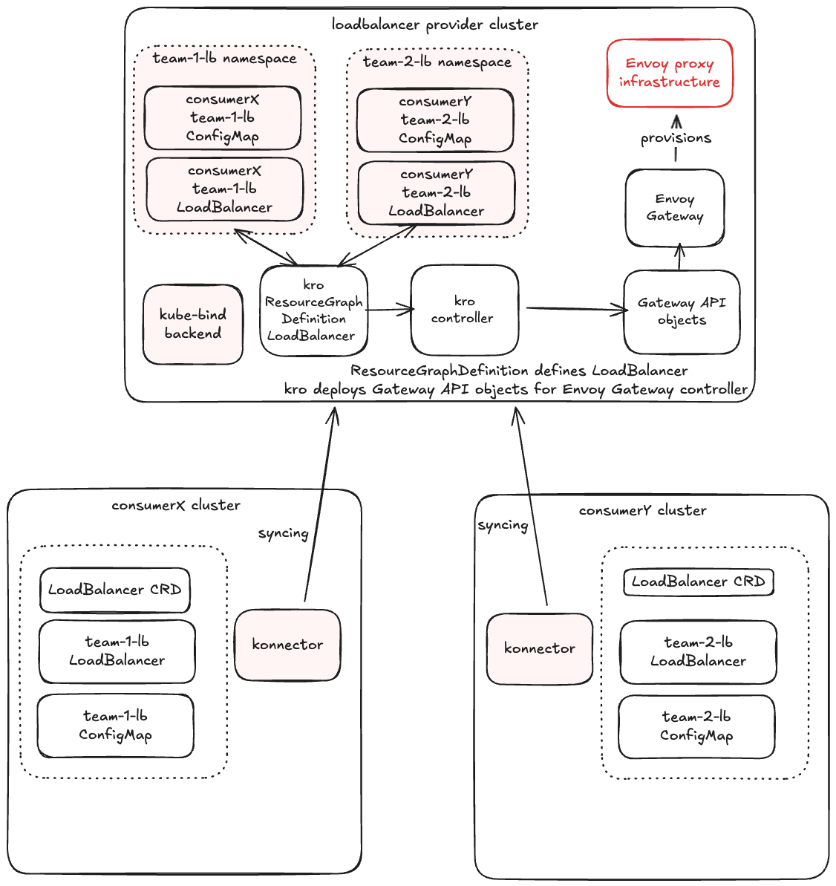

# kro Integration (providing LoadBalancer as a Service)

This guide demonstrates how to use [kro](https://kro.run/) and [Envoy Gateway](https://gateway.envoyproxy.io/) to offer a "LoadBalancer as a Service" API in multi-cluster environments.

When operating multiple clusters on-premises, managing load balancer infrastructure separately for each cluster becomes operationally expensive. This integration enables a centralized load balancer cluster that serves all tenant clusters connected via converged networking solutions. By running load balancer resources in a dedicated load balancer cluster, organizations can simplify operations for application teams who can self-service load balancers without managing the underlying infrastructure and enforce consistent security policies and configuration across gateways.



In this guide in the consumer cluster we create a simple `LoadBalancer` object, and the provider automatically provisions an Envoy Gateway infrastructure and related `Gateway` and `HTTPRoute` to expose the service between two kind clusters.

This example includes support for syncing **custom configuration (via ConfigMaps or Secrets)** from consumer clusters to the provider.

!!! note
    For this to work end-to-end, the consumer's service (`backend`) must be reachable from the provider cluster (e.g., via multi-cluster networking).

    In this example, we simulate multi-cluster networking by exposing the consumer's backend service via NodePort and creating corresponding Service/EndpointSlice in the provider cluster. In production, you would use proper multi-cluster networking solutions like Submariner or Cilium cluster mesh.

## Prerequisites

This integration guide uses two kind clusters, one provider and one consumer. Provision them using your preferred workflow and keep the resulting kubeconfigs handy.

*   **Provider Cluster:** Runs kro, Envoy Gateway, and the kube-bind backend.
*   **Consumer Cluster:** Runs the kube-bind konnector.

## Setup On The Provider Cluster

The following sections will guide you through the one-time setup that is required for providing LoadBalancer as a Service using kro and kube-bind.

Follow the [prerequisites](index.md#prerequisites), then select the provider:

```bash
kubectl config use-context provider
```

### Install Envoy Gateway

This component will handle the actual traffic routing.

```bash
helm install eg oci://docker.io/envoyproxy/gateway-helm --version v1.6.1 -n envoy-gateway-system --create-namespace
```

Install GatewayClass to be managed by Envoy Gateway.

```bash
kubectl apply -f - <<EOF
apiVersion: gateway.networking.k8s.io/v1
kind: GatewayClass
metadata:
  name: eg
spec:
  controllerName: gateway.envoyproxy.io/gatewayclass-controller
EOF
```

### Setup Backend Application Service

Fetch the consumer cluster node IP.

```bash
export CONSUMER_NODE_IP=$(kubectl --context=consumer get nodes -o jsonpath='{.items[0].status.addresses[?(@.type=="InternalIP")].address}')
```

Setup the provider cluster service to allow connection to the backend application in consumer cluster.

```bash
kubectl apply -f - <<EOF
apiVersion: v1
kind: Service
metadata:
  name: backend
  namespace: default
spec:
  clusterIP: None
  ports:
    - port: 30080
      targetPort: 30080
      protocol: TCP
      name: http
---
apiVersion: discovery.k8s.io/v1
kind: EndpointSlice
metadata:
  name: backend
  namespace: default
  labels:
    kubernetes.io/service-name: backend
addressType: IPv4
ports:
- name: http
  port: 30080
  protocol: TCP
endpoints:
- addresses:
    - ${CONSUMER_NODE_IP}
  conditions:
    ready: true
EOF
```

### Install kro

kro allows you to define custom APIs (`ResourceGraphDefinition`) and map them to underlying resources.

```bash
helm install kro oci://registry.k8s.io/kro/charts/kro \
  --namespace kro-system \
  --create-namespace
```

### Define the LoadBalancer ResourceGroup

Create a kro `ResourceGraphDefinition` that defines the API `loadbalancers.networking.kro.run`. This definition includes referencing a `ConfigMap` for custom routing rules (e.g., adding headers). The same way user could reference a `Secret` with `Certificate` to setup TLS.

```bash
kubectl apply -f - <<'EOF'
apiVersion: kro.run/v1alpha1
kind: ResourceGraphDefinition
metadata:
  name: loadbalancers
spec:
  schema:
    apiVersion: v1alpha1
    kind: LoadBalancer
    group: networking.kro.run
    metadata:
      labels:
        core.kbind.io/exported: "true"
    spec:
      domain: string
      configMapRef: string
      targetService: string
      targetServiceNamespace: string
      targetPort: integer | default=8080
    status:
      address: string
  resources:
  - id: configmap
    externalRef:
      apiVersion: v1
      kind: ConfigMap
      metadata:
        name: ${schema.spec.configMapRef}
        namespace: ${schema.metadata.namespace}
  - id: referencegrant
    template:
      apiVersion: gateway.networking.k8s.io/v1beta1
      kind: ReferenceGrant
      metadata:
        name: ${schema.metadata.name}-grant
        namespace: ${schema.spec.targetServiceNamespace}
      spec:
        from:
          - group: gateway.networking.k8s.io
            kind: HTTPRoute
            namespace: ${schema.metadata.namespace}
        to:
          - group: ""
            kind: Service
  - id: gateway
    template:
      apiVersion: gateway.networking.k8s.io/v1
      kind: Gateway
      metadata:
        name: ${schema.metadata.name}-gw
        namespace: ${schema.metadata.namespace}
      spec:
        gatewayClassName: eg
        listeners:
          - name: http
            port: 80
            protocol: HTTP
            hostname: ${schema.spec.domain}
  - id: route
    template:
      apiVersion: gateway.networking.k8s.io/v1
      kind: HTTPRoute
      metadata:
        name: ${schema.metadata.name}-route
        namespace: ${schema.metadata.namespace}
      spec:
        parentRefs:
        - name: ${schema.metadata.name}-gw
        hostnames:
        - ${schema.spec.domain}
        rules:
        - backendRefs:
          - name: ${schema.spec.targetService}
            namespace: ${schema.spec.targetServiceNamespace}
            port: ${schema.spec.targetPort}
          filters:
          - type: RequestHeaderModifier
            requestHeaderModifier:
              add:
              - name: X-Custom-Message
                value: ${configmap.?data["custom-header"]}
EOF
```

### Export the LoadBalancer API

Wait for kro to create the CRD and explicitly mark that CRD as exported:

```bash
kubectl wait --for=create crd/loadbalancers.networking.kro.run --timeout=120s
kubectl wait --for=condition=Established crd/loadbalancers.networking.kro.run --timeout=120s
kubectl label crd loadbalancers.networking.kro.run core.kbind.io/exported=true --overwrite
```

Create a catalog `Export`. Crucially, we add a related-resource rule so the provider can read the ConfigMap that the consumer will create and reference.

```bash
kubectl apply -f - <<EOF
apiVersion: catalog.kbind.io/v1alpha1
kind: Export
metadata:
  name: loadbalancer
spec:
  title: LoadBalancer as a Service
  description: Provision load balancers with kro and Envoy Gateway.
  apis:
    - name: loadbalancers.networking.kro.run
  defaults:
    relatedResources:
      - group: ""
        resource: configmaps
        direction: FromConsumer
        selector:
          names:
            - my-lb-config
EOF
```

This walkthrough keeps the ConfigMap name fixed. v2 related-resource selectors are name/label based, they do not follow `spec.configMapRef`.

## Setup on the Consumer Cluster

Now that everything is set up, users can begin to bind to your backend and begin consuming the new API.

```bash
kubectl config use-context consumer
```

### Login to kube-bind

```bash
kubectl bind login https://kube-bind.example.com
kubectl bind catalog
```

### Bind the Export

```bash
kubectl bind export loadbalancer \
  --kubeconfig=./consumer.kubeconfig \
  --install-konnector=false
```

The command applies the bundle for the `loadbalancer` Export to the consumer cluster. It assumes a matching konnector is already installed separately.

```bash
kubectl wait --for=condition=Established crd/loadbalancers.networking.kro.run --timeout=120s
```

!!! note
    v2 keeps namespace and name unchanged. This walkthrough uses `default` in both clusters rather than the old prefixed namespace form from the legacy docs.

### Create Dependencies

The consumer creates the `ConfigMap` that will be referenced by the `LoadBalancer`.

```bash
kubectl apply -f - <<EOF
apiVersion: v1
kind: ConfigMap
metadata:
  name: my-lb-config
  namespace: default
data:
  custom-header: "hello-kube-bind"
EOF
```

Deploy backend application into consumer cluster.

```bash
kubectl apply -f - <<EOF
apiVersion: v1
kind: ServiceAccount
metadata:
  name: backend
---
apiVersion: v1
kind: Service
metadata:
  name: backend
  labels:
    app: backend
    service: backend
spec:
  type: NodePort
  ports:
  - name: http
    port: 3000
    targetPort: 3000
    nodePort: 30080
  selector:
    app: backend
---
apiVersion: apps/v1
kind: Deployment
metadata:
  name: backend
spec:
  replicas: 1
  selector:
    matchLabels:
      app: backend
      version: v1
  template:
    metadata:
      labels:
        app: backend
        version: v1
    spec:
      serviceAccountName: backend
      containers:
      - image: gcr.io/k8s-staging-gateway-api/echo-basic:v20231214-v1.0.0-140-gf544a46e
        imagePullPolicy: IfNotPresent
        name: backend
        ports:
        - containerPort: 3000
        env:
        - name: POD_NAME
          valueFrom:
            fieldRef:
              fieldPath: metadata.name
        - name: NAMESPACE
          valueFrom:
            fieldRef:
              fieldPath: metadata.namespace
EOF
```

### Create a LoadBalancer

Reference the `ConfigMap` created above.

```bash
kubectl apply -f - <<EOF
apiVersion: networking.kro.run/v1alpha1
kind: LoadBalancer
metadata:
  name: my-lb
  namespace: default
spec:
  domain: "www.example.com"
  configMapRef: "my-lb-config"
  targetService: "backend"
  targetServiceNamespace: "default"
  targetPort: 30080
EOF
```

### Observe the Provisioning

**Provider Side:** kube-bind syncs the ConfigMap back to the provider namespace. kro creates the Gateway, Route and ReferenceGrant, and Envoy Gateway provisions the load balancer.

**Consumer Side:** The status is updated with the provider status.

Check `LoadBalancer` in the consumer cluster.

```bash
kubectl --context=consumer -n default get loadbalancer my-lb
```

```bash
NAMESPACE   NAME        STATE    READY   AGE
default     my-lb       ACTIVE   True    14s
```

Check `LoadBalancer` in the provider cluster and if the `ConfigMap` is synced.

```bash
kubectl --context=provider -n default get loadbalancers.networking.kro.run
```

```bash
NAMESPACE   NAME   STATE    READY   AGE
default     my-lb  ACTIVE   True    15s
```

```bash
kubectl --context=provider -n default get cm
```

```bash
NAME               DATA   AGE
kube-root-ca.crt   1      3h14m
my-lb-config       1      15s
```

## Appendix

Test the connection with provisioned load balancer and verify that `hello-kube-bind` header was added from the ConfigMap.

!!! note
    For the basic check in this example, we will do port-forward. To be able to use LoadBalancer service IP in the kind cluster you would need to setup additional measures like [metalb](https://github.com/metallb/metallb) or [cloud-provider-kind](https://github.com/kubernetes-sigs/cloud-provider-kind).

On the provider cluster list the Envoy services and find corresponding service name for the gateway.

```bash
kubectl --context=provider get services -n envoy-gateway-system
```

Port forward the related service for `my-lb`.

```bash
kubectl --context=provider -n envoy-gateway-system port-forward service/<generated-service-name> 8888:80
```

Send the request through the gateway service to your backend application.

```bash
curl --verbose --header "Host: www.example.com" http://localhost:8888/headers
```
```text
* Host localhost:8888 was resolved.
* IPv6: ::1
* IPv4: 127.0.0.1
*   Trying [::1]:8888...
* Connected to localhost (::1) port 8888
> GET /headers HTTP/1.1
> Host: www.example.com
> User-Agent: curl/8.7.1
> Accept: */*
>
* Request completely sent off
< HTTP/1.1 200 OK
< content-type: application/json
< x-content-type-options: nosniff
< date: Fri, 19 Dec 2025 19:50:35 GMT
< content-length: 521
< x-response-message: hello-kube-bind
<
{
  "path": "/headers",
  "host": "www.example.com",
  "method": "GET",
  "proto": "HTTP/1.1",
  "headers": {
    "Accept": [
      "*/*"
    ],
    "User-Agent": [
      "curl/8.7.1"
    ],
    "X-Custom-Message": [
      "hello-kube-bind"
    ],
    "X-Envoy-External-Address": [
      "172.18.0.2"
    ],
    "X-Forwarded-For": [
      "172.18.0.2"
    ],
    "X-Forwarded-Proto": [
      "http"
    ],
    "X-Request-Id": [
      "8c23f131-a328-485f-b7e1-2e6b20362af1"
    ]
  },
  "namespace": "default",
  "ingress": "",
  "service": "",
  "pod": "backend-77d4d5968-glxtp"
}
* Connection #0 to host localhost left intact
```
